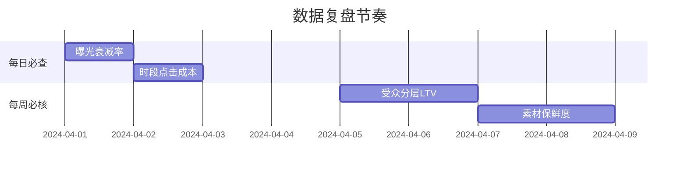

# Facebook广告效能提升全攻略

---

## 一、精准测试实战流程
### 1.1 素材组合测试框架
**基础配置**
- CBO系列预算：$40-60/日
- 最低单组预算：$5
- 测试周期：24-48小时

**组合策略**
1. 4组测试方案：
   - 2组图片素材 + 2组视频素材
   - 图/视频两两交叉组合
   - 相同受众兴趣标签

**评估维度**
- 视频素材：互动完成率>80%
- 图文素材：点击率>3% 或 ROI>1.5

---

## 二、精细优化操作体系
### 2.1 预算调控规范
**异常处理流程**
1. CPM上涨>20%时：
   - 立即暂停问题广告组
   - 00:00克隆新组重启测试
   - 保留原设置参数

**健康预算节奏**
- 单日增幅上限20%
- 预算分配公式：
```
日预算 = 原预算 × (1 + 近3日CTR增长率)
```

### 2.2 用户分层运营
**受众分级管理矩阵**

| 层级 | 特征          | 优化动作                     | 工具配置         |
|------|---------------|------------------------------|------------------|
| 冷层 | 0交互用户     | 3秒短视频冲击                | 智能受众拓展     |
| 温层 | 有浏览用户    | 动态产品推荐                 | LAL受众定向      |
| 热层 | 加购未转化    | 实时折扣推送                 | 弃单召回机器人   |

---

## 三、智能创意生成机制
### 3.1 PAS广告模板
**黄金文案框架**
```markdown
| 要素     | 标准要求                     | 案例展示                   |
|----------|------------------------------|---------------------------|
| 标题     | ◼️ ≤15字符                    | 🌟5折限时疯抢              |
| 痛点描述 | ◼️ 引发共鸣疑问句             | 皮肤暗沉多年无解？         |
| 解决方案 | ◼️ 数字量化优势               | 98%用户28天见效           |
| CTA      | ◼️ 动态地域标签               | 广东用户专享立减$20       |
```

### 3.2 动态优化方案
**实时更新规则**
- 每12小时轮换3组标题
- CTR下降>15%时即时替换
- 加入节假日热点词库

---

## 四、高效执行工具箱
### 4.1 标准化数据看板
**核心指标监测**


### 4.2 避险操作规范
**高危行为警示**
- ▸ 单素材连续投放>10天
- ▸ CTA按钮存在歧义选项
- ▸ 突然调整产品价格>20%
- ▸ 使用相同IP多账户操作

**优化案例数据**
某美妆品牌实施该体系30天后：
- CPM下降35% 
- ROI提升至1:6.8
- 素材制作效率提高2.7倍
- 日均询盘量增长220%
[教学视频](https://youtube.com/shorts/i91T8DlheR4?feature=share)
```
